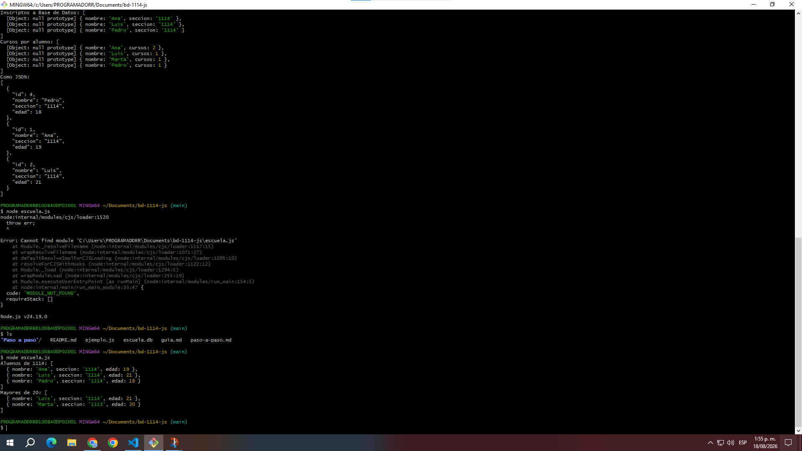
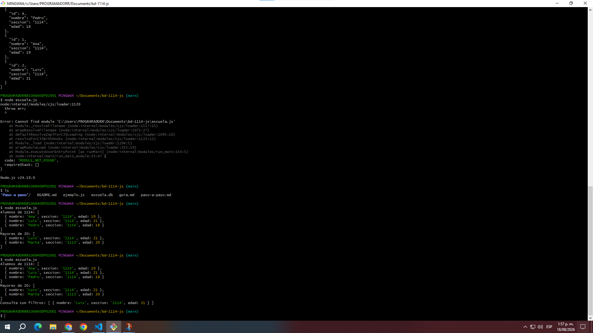
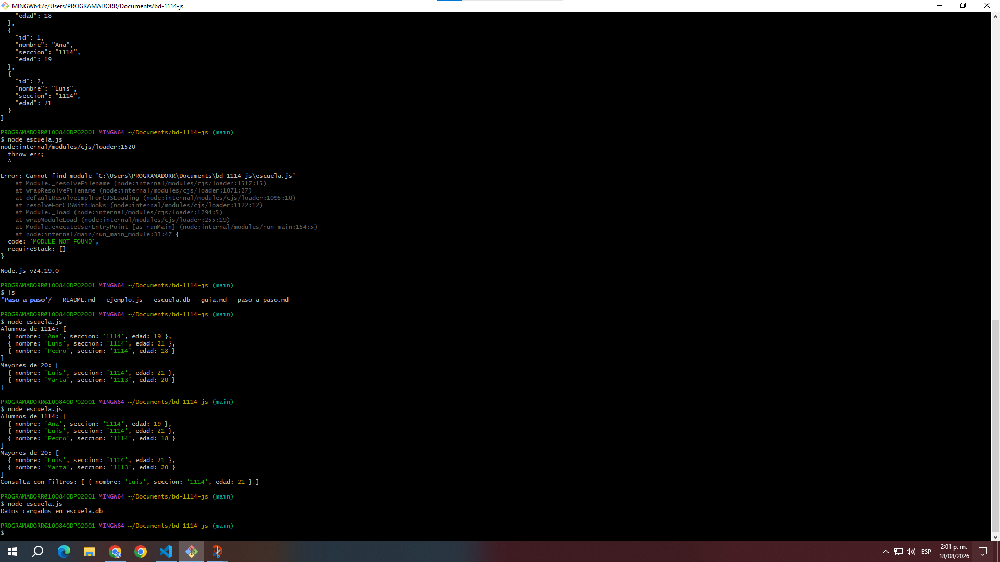
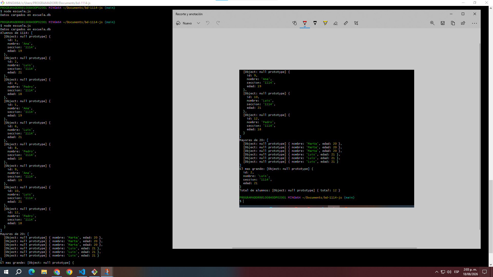
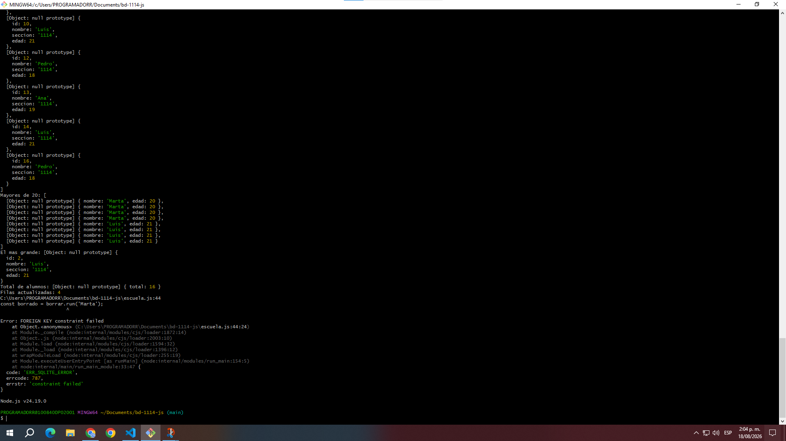
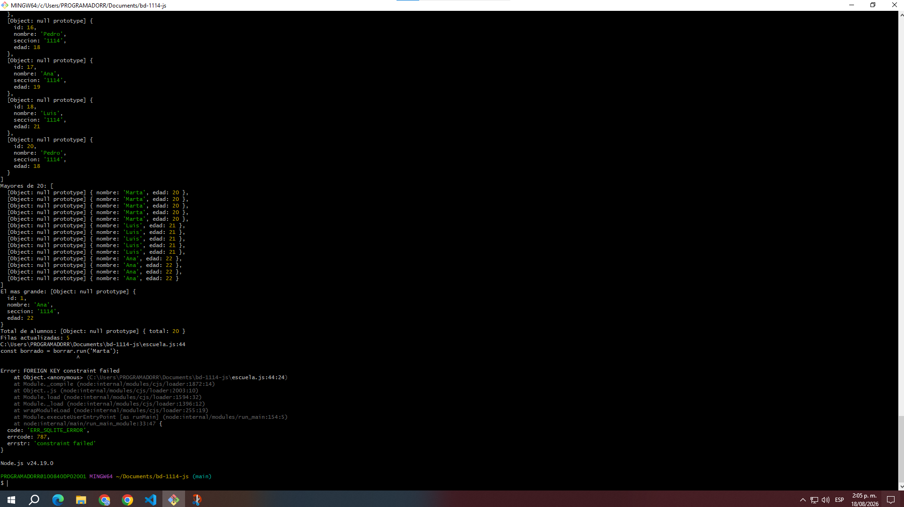
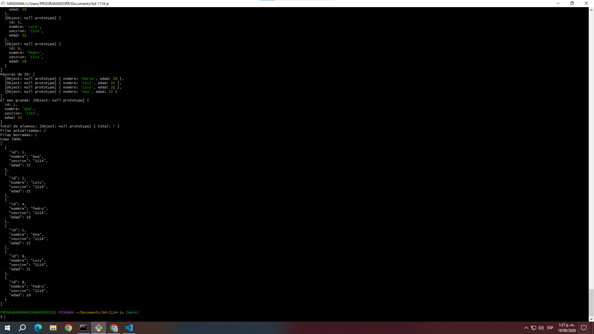

# ENTREGABLE RESPUESTAS ESCRITAS 

## ETAPA 1 

## ETAPA 2 

1. ¿Qué pasa con este código si necesito 5 filtros? ¿Y si necesito 10?

       filter en JavaScript se vuelve rígido, difícil de mantener y lento en memoria. La mejor práctica es delegar los filtros directamente a la base de datos con SQL o un ORM.

2. Si cerró el programa, ¿dónde quedaron los datos?

       Los datos quedaron guardados de forma permanente en tu disco duro, específicamente dentro del archivo escuela.db

## ETAPA 3 

## ETAPA 4 

## ETAPA 5 

## ETAPA 6 

## ETAPA 7 

1. ¿Qué alumnos se inscribieron a "Base de Datos"?

       Ninguno todavía

2. ¿Cuántos cursos tiene cada alumno?

       Actual es 0 cursos para todos.

# Entregable

    SQLite lo uso como la base de datos para almacenar de forma permanente y organizada toda la información de la escuela (alumnos, cursos e inscripciones). JSON lo uso como el formato estándar para empaquetar, mostrar y transferir esos mismos datos ordenadamente de una manera que sea fácil de leer.
